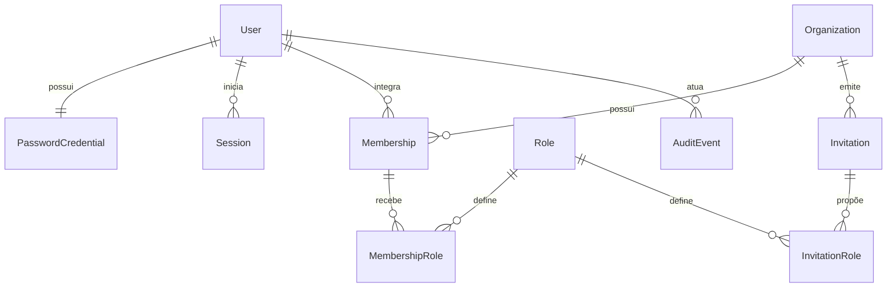

# Modelo de Dados: Identidade e Multi-Tenancy

**Feature:** `002-identity-tenancy`  
**Banco:** MySQL 8 compatível  
**ORM:** Prisma  
**Identificadores:** UUID

## Visão relacional



## Enums

```text
UserStatus         = PENDING_VERIFICATION | ACTIVE | BLOCKED | DISABLED
OrganizationStatus = ACTIVE | SUSPENDED | DISABLED
MembershipStatus   = ACTIVE | SUSPENDED | REMOVED
InvitationStatus   = PENDING | ACCEPTED | EXPIRED | REVOKED
ContextType        = PERSONAL | ORGANIZATION
AuditOutcome       = SUCCESS | FAILURE | DENIED
RoleScope          = ORGANIZATION | PLATFORM
```

## Entidades

### User

| Campo | Tipo | Regra |
|---|---|---|
| id | UUID | PK |
| email | string | Valor de exibição |
| normalizedEmail | string | Único, normalizado |
| displayName | string | 2–120 caracteres |
| status | UserStatus | Default `PENDING_VERIFICATION` |
| emailVerifiedAt | datetime? | UTC |
| createdAt / updatedAt | datetime | UTC |

Índices: unique `normalizedEmail`; index `status`.

### PasswordCredential

| Campo | Tipo | Regra |
|---|---|---|
| userId | UUID | PK/FK User |
| passwordHash | string | PHC string do Argon2id |
| changedAt | datetime | UTC |
| createdAt / updatedAt | datetime | UTC |

Nenhuma senha ou versão reversível é persistida.

### Session

| Campo | Tipo | Regra |
|---|---|---|
| id | UUID | PK; claim `sid` |
| userId | UUID | FK User |
| refreshTokenHash | string | Hash do token atual |
| tokenFamilyId | UUID | Agrupa rotações |
| currentJti | UUID | Identificador do refresh atual |
| previousJti | UUID? | Auxilia reuse detection |
| lastUsedAt | datetime | Idle timeout |
| idleExpiresAt | datetime | 30 minutos após atividade aceita |
| absoluteExpiresAt | datetime | 8 horas após criação |
| revokedAt | datetime? | Nulo enquanto válida |
| revokeReason | string? | Código controlado |
| ipHash / userAgentHash | string? | Pseudonimizados, se habilitados |
| createdAt / updatedAt | datetime | UTC |

Índices: `userId`, `tokenFamilyId`, `idleExpiresAt`, `absoluteExpiresAt`, `revokedAt`.

### EmailVerificationToken e PasswordResetToken

Campos comuns: `id`, `userId`, `tokenHash` único, `expiresAt`, `consumedAt?`, `revokedAt?`,
`createdAt`. Verificação expira em 24 horas; recuperação em 30 minutos.

### Organization

| Campo | Tipo | Regra |
|---|---|---|
| id | UUID | PK |
| name | string | 2–160 caracteres |
| slug | string | Único, normalizado |
| status | OrganizationStatus | Default `ACTIVE` |
| timezone | string | IANA; default configurado |
| createdByUserId | UUID | FK User |
| createdAt / updatedAt | datetime | UTC |

### Membership

| Campo | Tipo | Regra |
|---|---|---|
| id | UUID | PK |
| userId | UUID | FK User |
| organizationId | UUID | FK Organization, obrigatório |
| status | MembershipStatus | Default `ACTIVE` |
| joinedAt | datetime | UTC |
| suspendedAt / removedAt | datetime? | Ciclo de vida |
| createdAt / updatedAt | datetime | UTC |

Constraint única: `(userId, organizationId)`. Índices por organização/status e usuário/status.

### Role

| Campo | Tipo | Regra |
|---|---|---|
| id | UUID | PK |
| code | string | Único e imutável |
| scope | RoleScope | ORGANIZATION ou PLATFORM |
| description | string | Documentação funcional |

Seed organizacional: `INSTITUTION_ADMIN`, `TEACHER`, `REVIEWER`, `PARTICIPANT`.
Seed global: `SAAS_ADMIN`.

### MembershipRole

Campos: `membershipId`, `roleId`, `assignedByUserId`, `assignedAt`. PK composta
`(membershipId, roleId)`. Somente papéis `ORGANIZATION` são permitidos.

### PlatformRoleAssignment

Campos: `userId`, `roleId`, `assignedByUserId?`, `assignedAt`, `revokedAt?`. Somente papéis
`PLATFORM`. Não possui endpoint institucional de escrita.

### Invitation

| Campo | Tipo | Regra |
|---|---|---|
| id | UUID | PK |
| organizationId | UUID | FK obrigatória |
| email / normalizedEmail | string | Destinatário |
| tokenHash | string | Único |
| status | InvitationStatus | Default `PENDING` |
| expiresAt | datetime | 7 dias |
| acceptedAt / revokedAt | datetime? | Ciclo de vida |
| invitedByUserId | UUID | Ator |
| acceptedByUserId | UUID? | Deve corresponder ao e-mail |
| createdAt / updatedAt | datetime | UTC |

Índices por organização/status, e-mail/status e expiração.

### InvitationRole

Campos: `invitationId`, `roleId`; PK composta. Somente papéis organizacionais.

### ConsentRecord

Campos: `id`, `userId`, `documentType`, `documentVersion`, `acceptedAt`, `withdrawnAt?`,
`evidenceHash?`. Unique conforme política de versão/documento.

### AuditEvent

| Campo | Tipo | Regra |
|---|---|---|
| id | UUID | PK |
| actorUserId | UUID? | Nulo apenas para evento de sistema |
| organizationId | UUID? | Obrigatório quando houver tenant |
| action | string | Código controlado |
| targetType / targetId | string / UUID? | Alvo minimizado |
| outcome | AuditOutcome | SUCCESS, FAILURE ou DENIED |
| correlationId | UUID | Correlação com requisição |
| metadata | JSON? | Somente chaves allowlisted |
| occurredAt | datetime | UTC, imutável |
| expiresAt | datetime | Default ocorrido + 180 dias |

Índices: `(organizationId, occurredAt)`, `(actorUserId, occurredAt)`, `action`, `expiresAt`,
`correlationId`. O repositório expõe somente `append` e leitura autorizada.

## Regras Transacionais

1. Criar organização e membership do primeiro Admin na mesma transação.
2. Aceitar convite, criar/reativar membership, atribuir papéis e consumir convite na mesma
   transação.
3. Alterar/remover Admin usa transação e proteção contra concorrência para nunca deixar a
   organização sem Admin ativo.
4. Rotacionar refresh compara token atual, cria novo hash e invalida o anterior atomicamente.
5. Reuse detection revoga a família completa na mesma transação.
6. Reset de senha atualiza hash, consome token e revoga sessões atomicamente.

## Exclusão e Retenção

- Não usar hard delete para User, Organization, Membership, Invitation, Session ou AuditEvent
  por operações comuns.
- Tokens expirados podem ser removidos por job conforme política operacional.
- AuditEvent expira em 180 dias; limpeza deve ser limitada, monitorada e auditada.
- Direitos LGPD e retenções legais serão detalhados em política transversal posterior.

