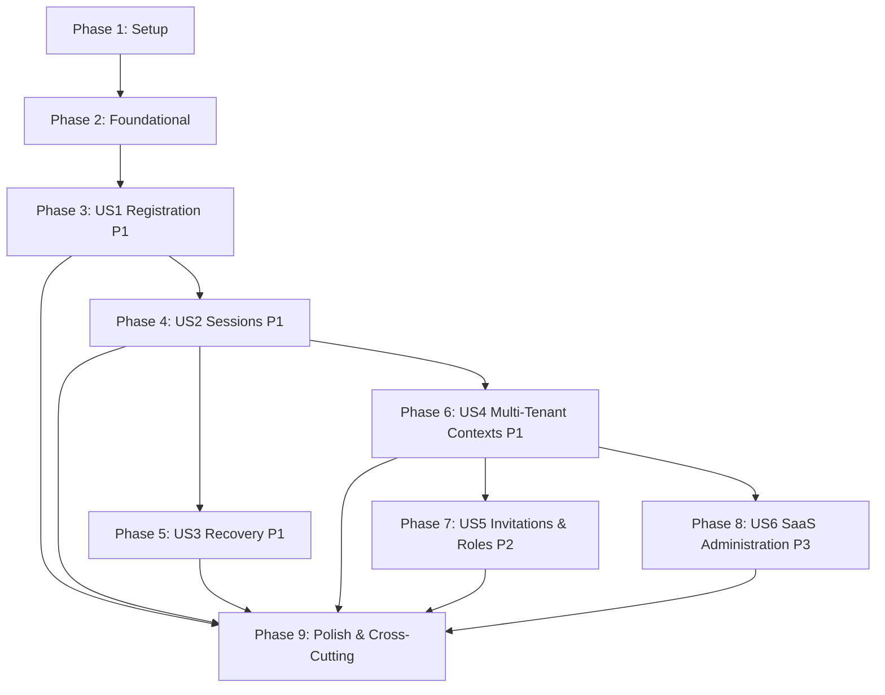

# Tasks: Identidade e Multi-Tenancy

**Feature**: `002-identity-tenancy`  
**Input Documents**: `spec.md`, `plan.md`, `data-model.md`, `research.md`, `contracts/identity.openapi.yaml`, `quickstart.md`  
**Status**: Ready for Implementation  

---

## Phase 1: Setup (Shared Infrastructure)

**Purpose**: Project dependency installation and shared infrastructure configuration

- [X] T001 Install backend dependencies (`argon2`, `@nestjs/jwt`, `nodemailer`, `@types/nodemailer`, `cookie-parser`, `@types/cookie-parser`) in `apps/api/package.json`
- [X] T002 [P] Configure local environment schema and runtime environment variables in `apps/api/src/config/environment.config.ts` and `.env.example`
- [X] T003 [P] Configure Mailpit connection and mailer transport configuration in `apps/api/src/modules/mail/mail.config.ts`

---

## Phase 2: Foundational (Blocking Prerequisites)

**Purpose**: Core data layer, security utilities, and tenant-aware authorization infrastructure that MUST be complete before ANY user story can be implemented

**⚠️ CRITICAL**: No user story work can begin until this phase is complete

- [X] T004 Update Prisma schema with all identity, session, organization, membership, role, invitation, consent, and audit models in `prisma/schema.prisma`
- [X] T005 Create and run database migration for identity and multi-tenancy schema in `prisma/migrations/`
- [X] T006 [P] Implement deterministic seed script for static roles (`INSTITUTION_ADMIN`, `TEACHER`, `REVIEWER`, `PARTICIPANT`, `SAAS_ADMIN`) in `prisma/seed.ts`
- [X] T007 [P] Implement standardized API error response filter and domain exceptions in `apps/api/src/common/filters/http-exception.filter.ts`
- [X] T008 [P] Implement correlation ID middleware attaching UUID to request context and response headers in `apps/api/src/common/middleware/correlation-id.middleware.ts`
- [X] T009 [P] Implement Argon2id password hasher service with SEC-EXC-001 parameters (`m=19456`, `t=2`, `p=1`) and common password blacklist validation in `apps/api/src/modules/identity/infrastructure/argon2-password-hasher.ts`
- [X] T010 [P] Implement crypto token generator service for single-use expiring token hashes in `apps/api/src/modules/identity/infrastructure/token.service.ts`
- [X] T011 [P] Implement CSRF double-submit protection middleware and `GET /auth/csrf` endpoint in `apps/api/src/modules/identity/presentation/csrf.controller.ts`
- [X] T012 Implement `NodemailerMailAdapter` conforming to `MailPort` in `apps/api/src/modules/mail/nodemailer-mail.adapter.ts`
- [X] T013 [P] Implement append-only `AuditService` and repository for security/admin audit events in `apps/api/src/modules/audit/audit.service.ts`
- [X] T014 Implement `TenantContextResolver`, `AuthenticationGuard`, and `PolicyService` for tenant isolation in `apps/api/src/modules/authorization/tenant-context.resolver.ts`
- [X] T015 [P] Implement frontend API client with credentials, CSRF token handling, and error toast support in `apps/web/src/lib/api-client.ts`

**Checkpoint**: Foundation ready — user story implementation can now begin in parallel

---

## Phase 3: User Story 1 - Register and access a personal context (Priority: P1) 🎯 MVP

**Goal**: Enable visitors to register with name, email, password, and legal consent; verify email ownership via single-use link; establish user in personal context with zero institutional or platform administrator privileges.

**Independent Test**: A visitor registers with an unused email, verifies via Mailpit link, authenticates, and reaches an empty personal context with zero institutional roles.

### Tests for User Story 1

> **NOTE: Write these tests FIRST, ensure they FAIL before implementation**

- [X] T016 [P] [US1] Unit test for registration validation, email normalization, and consent validation in `apps/api/test/unit/identity/register.spec.ts`
- [X] T017 [P] [US1] Integration test for registration, email verification token consumption, and personal context initialization in `apps/api/test/integration/identity/registration.integration-spec.ts`

### Implementation for User Story 1

- [X] T018 [P] [US1] Create verification email HTML/text template in `apps/api/src/modules/mail/templates/verify-email.template.ts`
- [X] T019 [P] [US1] Implement UserRepository and ConsentRecordRepository in `apps/api/src/modules/identity/infrastructure/user.repository.ts`
- [X] T020 [US1] Implement RegisterService with email normalization and neutral duplicate response in `apps/api/src/modules/identity/application/register.service.ts`
- [X] T021 [US1] Implement VerifyEmailService and ResendVerificationService in `apps/api/src/modules/identity/application/verify-email.service.ts`
- [X] T022 [US1] Implement `POST /auth/register`, `POST /auth/verify-email`, and `POST /auth/resend-verification` in `apps/api/src/modules/identity/presentation/auth.controller.ts`
- [X] T023 [P] [US1] Implement accessible frontend Registration page with password strength feedback in `apps/web/src/features/auth/RegisterPage.tsx`
- [X] T024 [P] [US1] Implement frontend Email Verification page and resend button in `apps/web/src/features/auth/VerifyEmailPage.tsx`
- [X] T025 [US1] E2E test for registration, Mailpit email verification, and personal context landing in `tests/e2e/registration.spec.ts`

**Checkpoint**: User Story 1 functional and verifiable independently.

---

## Phase 4: User Story 2 - Authenticate and manage secure sessions (Priority: P1)

**Goal**: Allow active verified users to sign in, receive revocable sessions with rotating refresh token and 15m access JWT in HttpOnly cookies, inspect identity at `/me`, enforce idle (30m) & absolute (8h) timeouts, detect refresh reuse revoking family, sign out, and enforce rate limiting.

**Independent Test**: Active user logs in, accesses `/me`, rotates tokens via `/auth/refresh`, logs out via `/auth/logout`, and confirms session is revoked server-side.

### Tests for User Story 2

> **NOTE: Write these tests FIRST, ensure they FAIL before implementation**

- [X] T026 [P] [US2] Unit test for session validation, rotation, and reuse detection in `apps/api/test/unit/sessions/session.service.spec.ts`
- [X] T027 [P] [US2] Integration test for login, token refresh rotation, refresh reuse detection family revocation, and logout in `apps/api/test/integration/sessions/session-lifecycle.integration-spec.ts`
- [X] T028 [P] [US2] Integration test for login rate limiting and neutral error anti-enumeration in `apps/api/test/integration/identity/auth-abuse.integration-spec.ts`

### Implementation for User Story 2

- [X] T029 [P] [US2] Implement SessionRepository in `apps/api/src/modules/sessions/session.repository.ts`
- [X] T030 [US2] Implement SessionService managing idle (30m), absolute (8h) TTLs, rotation, and reuse detection in `apps/api/src/modules/sessions/session.service.ts`
- [X] T031 [US2] Implement LoginService and LogoutService issuing and clearing secure cookies in `apps/api/src/modules/identity/application/login.service.ts`
- [X] T032 [US2] Implement `POST /auth/login`, `POST /auth/refresh`, `POST /auth/logout`, and `GET /me` endpoints in `apps/api/src/modules/identity/presentation/auth.controller.ts`
- [X] T033 [P] [US2] Implement rate limiting guard for auth endpoints in `apps/api/src/modules/identity/infrastructure/rate-limiter.guard.ts`
- [X] T034 [P] [US2] Implement accessible frontend Login page and AuthProvider context in `apps/web/src/features/auth/LoginPage.tsx` and `apps/web/src/features/auth/AuthProvider.tsx`
- [X] T035 [US2] E2E test for login, token rotation, idle expiration, and logout in `tests/e2e/auth-sessions.spec.ts`

**Checkpoint**: User Stories 1 and 2 work together; user registration, verification, login, refresh, and logout are functional.

---

## Phase 5: User Story 3 - Recover access after forgetting a password (Priority: P1)

**Goal**: Allow users who forgot their password to request a recovery link (neutral response preventing enumeration), receive a single-use 30m token via email, reset password with full policy enforcement, and revoke all existing sessions atomically.

**Independent Test**: User requests recovery, receives link in Mailpit, submits new password, logs in with new password, and verifies older sessions and old password are rejected.

### Tests for User Story 3

> **NOTE: Write these tests FIRST, ensure they FAIL before implementation**

- [X] T036 [P] [US3] Unit test for password reset token lifecycle and session revocation logic in `apps/api/test/unit/identity/password-reset.spec.ts`
- [X] T037 [P] [US3] Integration test for forgot-password, token verification, password reset, and session invalidation in `apps/api/test/integration/identity/password-recovery.integration-spec.ts`

### Implementation for User Story 3

- [X] T038 [P] [US3] Create password reset email HTML/text template in `apps/api/src/modules/mail/templates/password-reset.template.ts`
- [X] T039 [P] [US3] Implement PasswordResetTokenRepository in `apps/api/src/modules/identity/infrastructure/password-reset-token.repository.ts`
- [X] T040 [US3] Implement PasswordResetService handling neutral request, token validation, hash update, and atomic session revocation in `apps/api/src/modules/identity/application/password-reset.service.ts`
- [X] T041 [US3] Implement `POST /auth/forgot-password` and `POST /auth/reset-password` endpoints in `apps/api/src/modules/identity/presentation/auth.controller.ts`
- [X] T042 [P] [US3] Implement accessible frontend ForgotPassword and ResetPassword pages in `apps/web/src/features/auth/ForgotPasswordPage.tsx` and `apps/web/src/features/auth/ResetPasswordPage.tsx`
- [X] T043 [US3] E2E test for complete password recovery journey in `tests/e2e/password-recovery.spec.ts`

**Checkpoint**: Self-service recovery operational and verified without support dependency.

---

## Phase 6: User Story 4 - Create and switch organization contexts (Priority: P1)

**Goal**: Authenticated users can create an organization (becoming its first Institutional Administrator atomically), list available personal and institutional contexts (`/me/contexts`), switch active context, and enforce server-validated tenant isolation where cross-tenant operations are denied.

**Independent Test**: Authenticated user creates Org A, joins Org B, switches between Org A, Org B, and Personal contexts, and queries verify resource isolation across boundaries.

### Tests for User Story 4

> **NOTE: Write these tests FIRST, ensure they FAIL before implementation**

- [X] T044 [P] [US4] Unit test for ContextService, TenantContextResolver, and cross-tenant access denial rules in `apps/api/test/unit/authorization/tenant-context.spec.ts`
- [X] T045 [P] [US4] Integration test for atomic organization creation and first admin membership assignment in `apps/api/test/integration/organizations/create-organization.integration-spec.ts`
- [X] T046 [P] [US4] Integration test for `/me/contexts` endpoint and cross-tenant boundary enforcement in `apps/api/test/integration/organizations/tenant-isolation.integration-spec.ts`

### Implementation for User Story 4

- [X] T047 [P] [US4] Implement OrganizationRepository and MembershipRepository requiring explicit organizationId in `apps/api/src/modules/organizations/organization.repository.ts` and `apps/api/src/modules/memberships/membership.repository.ts`
- [X] T048 [US4] Implement OrganizationService for slug validation, organization creation, and atomic admin membership in `apps/api/src/modules/organizations/organization.service.ts`
- [X] T049 [US4] Implement ContextService listing personal and institutional contexts in `apps/api/src/modules/identity/application/context.service.ts`
- [X] T050 [US4] Implement `POST /organizations` and `GET /me/contexts` endpoints in `apps/api/src/modules/organizations/presentation/organization.controller.ts` and `apps/api/src/modules/identity/presentation/context.controller.ts`
- [X] T051 [P] [US4] Implement accessible frontend ContextSwitcher and CreateOrganization modal in `apps/web/src/features/context-switcher/ContextSwitcher.tsx` and `apps/web/src/features/organizations/CreateOrganizationModal.tsx`
- [X] T052 [US4] E2E test for organization creation, context switching, and cross-tenant denial in `tests/e2e/tenant-switching.spec.ts`

**Checkpoint**: Multi-tenancy foundation ready; organizations and personal contexts cleanly separated.

---

## Phase 7: User Story 5 - Invite members and assign institutional roles (Priority: P2)

**Goal**: Institutional Administrator can invite members by email with approved organization roles (`INSTITUTION_ADMIN`, `TEACHER`, `REVIEWER`, `PARTICIPANT`), resend or revoke invitations, invitee accepts linking to account without duplicate user, admin can update member status (suspend/reactivate) and roles with strict last-admin concurrency protection.

**Independent Test**: Admin invites user as Teacher; invitee receives email, accepts, and accesses Org as Teacher; attempt to remove last Admin is blocked.

### Tests for User Story 5

> **NOTE: Write these tests FIRST, ensure they FAIL before implementation**

- [X] T053 [P] [US5] Unit test for last-admin protection constraint and institutional role validation in `apps/api/test/unit/memberships/membership-rules.spec.ts`
- [X] T054 [P] [US5] Integration test for invitation creation, resend, revoke, and atomic acceptance linking in `apps/api/test/integration/invitations/invitation-lifecycle.integration-spec.ts`
- [X] T055 [P] [US5] Integration test for concurrent last-admin removal prevention in `apps/api/test/integration/memberships/last-admin-protection.integration-spec.ts`

### Implementation for User Story 5

- [X] T056 [P] [US5] Create member invitation email HTML/text template in `apps/api/src/modules/mail/templates/invitation.template.ts`
- [X] T057 [P] [US5] Implement InvitationRepository and InvitationRole repository in `apps/api/src/modules/invitations/invitation.repository.ts`
- [X] T058 [US5] Implement InvitationService for creating, resending, revoking, and accepting invitations in `apps/api/src/modules/invitations/invitation.service.ts`
- [X] T059 [US5] Implement MembershipManagementService with last-admin check and status transitions in `apps/api/src/modules/memberships/membership-management.service.ts`
- [X] T060 [US5] Implement invitation and member management controllers in `apps/api/src/modules/invitations/presentation/invitation.controller.ts` and `apps/api/src/modules/organizations/presentation/members.controller.ts`
- [X] T061 [P] [US5] Implement accessible frontend Member Management page (member list, role edit, suspend/reactivate) in `apps/web/src/features/member-management/MemberListPage.tsx`
- [X] T062 [P] [US5] Implement accessible frontend Invite Member modal and Accept Invitation page in `apps/web/src/features/member-management/InviteMemberModal.tsx` and `apps/web/src/features/invitations/AcceptInvitationPage.tsx`
- [X] T063 [US5] E2E test for invitation lifecycle, role assignment, acceptance, and last-admin block in `tests/e2e/member-management.spec.ts`

**Checkpoint**: Institutional member onboarding, role assignment, and organization administration fully operational.

---

## Phase 8: User Story 6 - Operate platform administration separately (Priority: P3)

**Goal**: SaaS Administrator role is managed separately via operational provisioning; SaaS admin can list organizations (`/platform/organizations`) and update organization status (`/platform/organizations/{organizationId}/status` with audited reason), with complete denial of SaaS operations to non-SaaS users and no automatic access to tenant content data.

**Independent Test**: Provision SaaS admin via CLI script, login, view organizations list, suspend an organization with audited reason; non-admin user is rejected with 403.

### Tests for User Story 6

> **NOTE: Write these tests FIRST, ensure they FAIL before implementation**

- [X] T064 [P] [US6] Unit test for PlatformRoleGuard and SaaS admin policy evaluation in `apps/api/test/unit/authorization/platform-role.spec.ts`
- [X] T065 [P] [US6] Integration test for SaaS admin CLI provisioning script, organization listing, and status update in `apps/api/test/integration/platform/platform-admin.integration-spec.ts`
- [X] T066 [P] [US6] Integration test verifying non-SaaS users and institutional admins receive 403 on platform endpoints in `apps/api/test/integration/platform/platform-access-denial.integration-spec.ts`

### Implementation for User Story 6

- [X] T067 [P] [US6] Implement operational CLI provisioning script for SaaS Admin in `apps/api/src/modules/platform/scripts/provision-saas-admin.ts`
- [X] T068 [US6] Implement PlatformService and PlatformRoleGuard in `apps/api/src/modules/platform/platform.service.ts` and `apps/api/src/modules/authorization/platform-role.guard.ts`
- [X] T069 [US6] Implement `GET /platform/organizations` and `PATCH /platform/organizations/{organizationId}/status` in `apps/api/src/modules/platform/presentation/platform.controller.ts`
- [X] T070 [P] [US6] Implement accessible frontend SaaS Admin platform dashboard in `apps/web/src/features/platform/PlatformOrganizationsPage.tsx`
- [X] T071 [US6] E2E test for SaaS admin operations, audit generation, and unauthorized access rejection in `tests/e2e/platform-admin.spec.ts`

**Checkpoint**: Platform operations isolated, operational provisioning functional, audit logs complete.

---

## Phase 9: Polish & Cross-Cutting Concerns

**Purpose**: Cross-tenant isolation verification, security hardening, audit retention cleanup, accessibility audit, and quickstart end-to-end execution

- [X] T072 [P] Implement automated cross-tenant security matrix test suite (Tenant A vs Tenant B vs Personal) in `tests/integration/security/cross-tenant-matrix.integration-spec.ts`
- [X] T073 [P] Implement AuditEvent retention cleanup job with unit tests in `apps/api/src/modules/audit/audit-cleanup.job.ts` and `apps/api/test/unit/audit/audit-cleanup.spec.ts`
- [X] T074 [P] Implement automated accessibility (WCAG 2.2 AA) tests covering all auth, context, and admin pages in `tests/e2e/accessibility.spec.ts`
- [X] T075 [P] Implement OpenAPI documentation endpoint synchronization test in `apps/api/test/integration/openapi/contract-sync.integration-spec.ts`
- [X] T076 Run complete quickstart verification workflow (`pnpm format:check`, `pnpm lint`, `pnpm typecheck`, `pnpm test`, `pnpm test:integration`, `pnpm build`, `pnpm test:e2e`) per `specs/002-identity-tenancy/quickstart.md`

---

## Dependencies & Execution Order

### Phase Dependencies

- **Setup (Phase 1)**: No dependencies — can start immediately.
- **Foundational (Phase 2)**: Depends on Setup completion — **BLOCKS all user stories**.
- **User Story 1 (Phase 3, P1)**: Depends on Foundational completion.
- **User Story 2 (Phase 4, P1)**: Depends on Foundational and User Story 1 (User entity & credentials).
- **User Story 3 (Phase 5, P1)**: Depends on Foundational and User Story 1 & 2 (User entity & session revocation).
- **User Story 4 (Phase 6, P1)**: Depends on Foundational and User Story 1 & 2 (authenticated user context).
- **User Story 5 (Phase 7, P2)**: Depends on User Story 4 (organizations and memberships established).
- **User Story 6 (Phase 8, P3)**: Depends on User Story 4 (organizations to list/manage) and Foundational.
- **Polish (Phase 9)**: Depends on all user stories (Phase 3 through 8) completion.

### User Story Dependencies



### Within Each User Story

- Tests MUST be written FIRST and fail before implementation code is added.
- Domain models and repositories before application services.
- Application services before HTTP presentation controllers.
- Backend endpoints before frontend UI features.
- Story complete and verified before moving to next priority.

### Parallel Opportunities

- Within Phase 1: T002 and T003 can run in parallel once dependencies are planned.
- Within Phase 2: T006, T007, T008, T009, T010, T011, T013, T015 can run in parallel after T004 & T005 migration.
- Within each Story: All test tasks marked `[P]` can run in parallel.
- All email templates and frontend pages marked `[P]` can run in parallel with backend services.
- Once User Story 4 is complete, User Story 5 (P2) and User Story 6 (P3) can proceed in parallel if team capacity allows.

---

## Parallel Example: User Story 1

```bash
# Launch all tests for User Story 1 together:
Task: "T016 [P] [US1] Unit test for registration validation, email normalization, and consent validation in apps/api/test/unit/identity/register.spec.ts"
Task: "T017 [P] [US1] Integration test for registration, email verification token consumption, and personal context initialization in apps/api/test/integration/identity/registration.integration-spec.ts"

# Launch models, repositories, and templates together:
Task: "T018 [P] [US1] Create verification email HTML/text template in apps/api/src/modules/mail/templates/verify-email.template.ts"
Task: "T019 [P] [US1] Implement UserRepository and ConsentRecordRepository in apps/api/src/modules/identity/infrastructure/user.repository.ts"

# Launch frontend pages together:
Task: "T023 [P] [US1] Implement accessible frontend Registration page with password strength feedback in apps/web/src/features/auth/RegisterPage.tsx"
Task: "T024 [P] [US1] Implement frontend Email Verification page and resend button in apps/web/src/features/auth/VerifyEmailPage.tsx"
```

---

## Implementation Strategy

### MVP First (User Story 1 + User Story 2)

1. Complete Phase 1: Setup
2. Complete Phase 2: Foundational (CRITICAL — blocks all stories)
3. Complete Phase 3: User Story 1 (Registration & Verification)
4. Complete Phase 4: User Story 2 (Authentication, Sessions & Personal Context)
5. **STOP and VALIDATE**: Verify registration, verification, login, `/me`, and logout independently (MVP achieved!).

### Incremental Delivery

1. Setup + Foundational → Foundation ready.
2. Add US1 → Public registration & email verification functional.
3. Add US2 → Secure session management and personal context functional (MVP!).
4. Add US3 → Self-service password recovery functional without support dependency.
5. Add US4 → Multi-organization context switching and tenant isolation operational.
6. Add US5 → Institutional invitations and member role management operational.
7. Add US6 → Platform administration operational and isolated.
8. Polish & Hardening → Security matrix, accessibility, and complete CI quickstart passing.

---

## Notes

- `[P]` tasks = different files, no dependencies on uncompleted work.
- `[Story]` label (`[US1]`, `[US2]`, etc.) maps task directly to user stories for traceability.
- Each user story is independently completable and verifiable.
- Automated tests MUST fail before implementing business logic (Test-First principle).
- No secrets, plain passwords, or tokens in logs or git commits.
